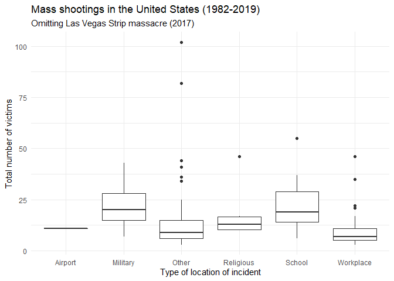
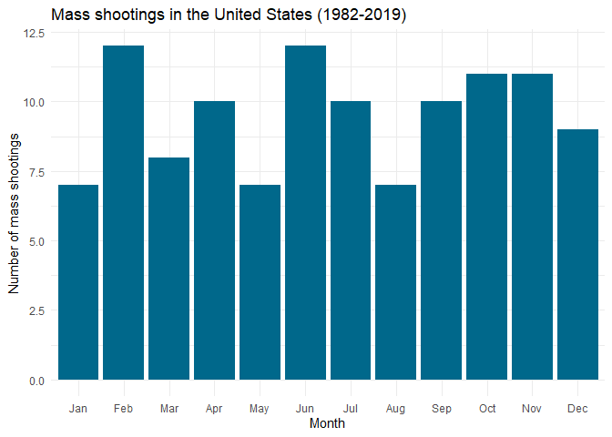

Exploring Mass Shootings in America
================
Kejing Li

## Get the data

``` r
library(tidyverse)    # load tidyverse packages, including ggplot2
```

    ## -- Attaching packages ------------------------------------------------------ tidyverse 1.2.1 --

    ## v ggplot2 3.2.1     v purrr   0.3.2
    ## v tibble  2.1.3     v dplyr   0.8.3
    ## v tidyr   1.0.0     v stringr 1.4.0
    ## v readr   1.3.1     v forcats 0.4.0

    ## -- Conflicts --------------------------------------------------------- tidyverse_conflicts() --
    ## x dplyr::filter() masks stats::filter()
    ## x dplyr::lag()    masks stats::lag()

``` r
library(knitr)        # load functions for formatting tables

# get data from rcfss package
# install latest version if not already installed
# devtools::install_github("uc-cfss/rcfss")
library(rcfss)

# load the data
data("mass_shootings")
mass_shootings
```

    ## # A tibble: 114 x 14
    ##    case   year month   day location summary fatalities injured
    ##    <chr> <dbl> <chr> <int> <chr>    <chr>        <dbl>   <dbl>
    ##  1 Dayt~  2019 Aug       4 Dayton,~ PENDING          9      27
    ##  2 El P~  2019 Aug       3 El Paso~ PENDING         20      26
    ##  3 Gilr~  2019 Jul      28 Gilroy,~ "Santi~          3      12
    ##  4 Virg~  2019 May      31 Virgini~ "DeWay~         12       4
    ##  5 Harr~  2019 Feb      15 Aurora,~ Gary M~          5       6
    ##  6 Penn~  2019 Jan      24 State C~ Jordan~          3       1
    ##  7 SunT~  2019 Jan      23 Sebring~ "Zephe~          5       0
    ##  8 Merc~  2018 Nov      19 Chicago~ Juan L~          3       0
    ##  9 Thou~  2018 Nov       7 Thousan~ Ian Da~         12      22
    ## 10 Tree~  2018 Oct      27 Pittsbu~ "Rober~         11       6
    ## # ... with 104 more rows, and 6 more variables: total_victims <dbl>,
    ## #   location_type <chr>, male <lgl>, age_of_shooter <dbl>, race <chr>,
    ## #   prior_mental_illness <chr>

``` r
# generate an excel to get a better overview of the data
write_excel_csv(mass_shootings,"mass_shootings.excel")
```

## Generate a data frame that summarizes the number of mass shootings per year. Print the data frame as a formatted `kable()` table.

``` r
#Count the number of mass shootings by year 
shootings_by_year <- mass_shootings %>% count(year)

#Print the data frame as a formatted kable() table.
kable(shootings_by_year, 
      col.names = c("Year", "Number of mass shootings"), 
      caption =  "Mass shootings in the United States (1982-2019)")
```

| Year | Number of mass shootings |
| ---: | -----------------------: |
| 1982 |                        1 |
| 1984 |                        2 |
| 1986 |                        1 |
| 1987 |                        1 |
| 1988 |                        1 |
| 1989 |                        2 |
| 1990 |                        1 |
| 1991 |                        3 |
| 1992 |                        2 |
| 1993 |                        4 |
| 1994 |                        1 |
| 1995 |                        1 |
| 1996 |                        1 |
| 1997 |                        2 |
| 1998 |                        3 |
| 1999 |                        5 |
| 2000 |                        1 |
| 2001 |                        1 |
| 2003 |                        1 |
| 2004 |                        1 |
| 2005 |                        2 |
| 2006 |                        3 |
| 2007 |                        4 |
| 2008 |                        3 |
| 2009 |                        4 |
| 2010 |                        1 |
| 2011 |                        3 |
| 2012 |                        7 |
| 2013 |                        5 |
| 2014 |                        4 |
| 2015 |                        7 |
| 2016 |                        6 |
| 2017 |                       11 |
| 2018 |                       12 |
| 2019 |                        7 |

Mass shootings in the United States (1982-2019)

## Generate a bar chart that identifies the number of mass shooters associated with each race category. The bars should be sorted from highest to lowest.

``` r
#count the number of mass shootings by race and filter out the NA value
shootings_by_race <- mass_shootings %>% 
  count(race) %>%
  filter(!is.na(race))

#draw the bar graph
#reoder from highest to lowest
#change the default stat to identity to map the y value
ggplot(shootings_by_race,aes(reorder(race, -n), n))+
  geom_bar(stat = "identity")+
  labs(title = "Mass shootings in the United States (1982-2019)",
         x = "Race of perpetrator",
         y = "Number of incidents") 
```

<!-- -->

## Generate a boxplot visualizing the number of total victims, by type of location. Redraw the same plot, but remove the Las Vegas Strip massacre from the dataset.

``` r
#Use boxplot to map a categorical and a continuous variable
ggplot(mass_shootings)+
  geom_boxplot(aes(location_type, total_victims))+
  labs(title = "Mass shootings in the United States (1982-2019)",
       x = "Type of location of incident", 
       y = "Total number of victims")
```

<!-- -->

``` r
# The above graph is not so imformative beacause of one evident outlier 
# Here, that outlier has been removed by 'filter()' function
filter(mass_shootings, case != "Las Vegas Strip massacre") %>%
  ggplot(aes(location_type, total_victims))+
  geom_boxplot()+
  labs(title = "Mass shootings in the United States (1982-2019)",
       subtitle = "Omitting Las Vegas Strip massacre (2017)",
       x = "Type of location of incident", 
       y = "Total number of victims")
```

<!-- -->

## How many white males with prior signs of mental illness initiated a mass shooting after 2000?

``` r
#Use 'filter()' to filter out the described criteria 
#Summarize the number after filtering 
mass_shootings %>%
  filter(race == "White", 
         male == "TRUE",
         prior_mental_illness == "Yes",
         year > 2000) %>%
  summarise(n())
```

    ## # A tibble: 1 x 1
    ##   `n()`
    ##   <int>
    ## 1    20

**Answer:** 20 white males with prior signs of mental illness initiated
a mass shooting after 2000.

## Which month of the year has the most mass shootings? Generate a bar chart sorted in chronological order to provide evidence of your answer.

``` r
#Convert "month" column into an ordered factor
mass_shootings$month <- factor(mass_shootings$month, month.abb, ordered=TRUE)

#Draw the bar graph
mass_shootings %>%
  ggplot(aes(month))+
  geom_bar()+
  labs(title = "Mass shootings in the United States (1982-2019)",
       x = "Month",
       y = "Number of mass shootings") 
```

<!-- -->

**Answer:** As shown above, Feb. and Jun. have the most mass shootings.

## How does the distribution of mass shooting fatalities differ between white and black shooters? What about white and latino shooters?

``` r
#Filter out the 3 races concerned
mass_shootings %>%
  filter(race %in% c("White", "Black","Latino") ) %>%
  
#It's hard to see the difference in distribution because the number of incidents differ so much
#Display density to standardize so that the area under each frequency polygen is one
  ggplot(aes(fatalities, ..density.., color = race))+ 
  geom_freqpoly(binwidth = 2)+
  labs(title = "Mass shootings in the United States (1982-2019)",
        x = "Number of fatalities per incident",
        y = "Number of incidents in propotion",
        color = "Race") +
  
#To show the graph in approriate scale, move legend to the bottom
  theme(legend.position = "bottom")
```

<!-- -->

**Answer:** Generally, the White shooters cause larger number of
fatalities than the other 2 races and its variance is also the highest.
In contrast, number of fatalities of Latino shooters are lowest among
three.

## Are mass shootings with shooters suffering from mental illness different from mass shootings with no signs of mental illness in the shooter? Assess the relationship between mental illness and total victims, mental illness and race, and the intersection of all three variables.

### Mental illness and total victims

``` r
mass_shootings %>%
  filter(!is.na(prior_mental_illness)) %>%
  ggplot(aes(prior_mental_illness, total_victims))+ 
  geom_boxplot()+
  labs(title = "Mass shootings in the United States (1982-2019)",
        x = "Evidence of prior mental illness by perpetrator",
        y = "Number of total victims")
```

<!-- -->

**Conclusion:** Most mass shootings are commited by those with prior
mental illness.

### Mental illness and race

``` r
mass_shootings %>%
  filter(!is.na(race), !is.na(prior_mental_illness)) %>%
  ggplot(aes(race, prior_mental_illness))+ 
  geom_count()+
  labs(title = "Mass shootings in the United States (1982-2019)",
        x = "Race of perpetrator",
        y = "Evidence of prior mental illness by perpetrator")
```

<!-- -->

**Conclusion:** White perpetrators with evidence of prior illness is the
largest subgroup among all the subgroups.

### Intersection of mental illness, race and totoal number of victims

``` r
mass_shootings %>%
  filter(!is.na(prior_mental_illness), !is.na(race) ) %>%
  ggplot(aes(prior_mental_illness, total_victims, fill = race))+ 
  geom_boxplot()+
  labs(title = "Mass shootings in the United States (1982-2019)",
        x = "Evidence of prior mental illness by perpetrator",
        y = "Number of total victims",
        fill = "Race")+
  theme(legend.position = "bottom")
```

<!-- -->

**Conclusion:** Most perpetrators have evidence of prior mental illness
in all races.

## Session info

``` r
devtools::session_info()
```

    ## - Session info ----------------------------------------------------------
    ##  setting  value                       
    ##  version  R version 3.6.1 (2019-07-05)
    ##  os       Windows 10 x64              
    ##  system   x86_64, mingw32             
    ##  ui       RTerm                       
    ##  language (EN)                        
    ##  collate  English_United States.1252  
    ##  ctype    English_United States.1252  
    ##  tz       America/Chicago             
    ##  date     2019-10-14                  
    ## 
    ## - Packages --------------------------------------------------------------
    ##  package     * version date       lib source                        
    ##  assertthat    0.2.1   2019-03-21 [1] CRAN (R 3.6.1)                
    ##  backports     1.1.5   2019-10-02 [1] CRAN (R 3.6.1)                
    ##  broom         0.5.2   2019-04-07 [1] CRAN (R 3.6.1)                
    ##  callr         3.3.2   2019-09-22 [1] CRAN (R 3.6.1)                
    ##  cellranger    1.1.0   2016-07-27 [1] CRAN (R 3.6.1)                
    ##  cli           1.1.0   2019-03-19 [1] CRAN (R 3.6.1)                
    ##  colorspace    1.4-1   2019-03-18 [1] CRAN (R 3.6.1)                
    ##  crayon        1.3.4   2017-09-16 [1] CRAN (R 3.6.1)                
    ##  desc          1.2.0   2018-05-01 [1] CRAN (R 3.6.1)                
    ##  devtools      2.2.1   2019-09-24 [1] CRAN (R 3.6.1)                
    ##  digest        0.6.21  2019-09-20 [1] CRAN (R 3.6.1)                
    ##  dplyr       * 0.8.3   2019-07-04 [1] CRAN (R 3.6.1)                
    ##  ellipsis      0.3.0   2019-09-20 [1] CRAN (R 3.6.1)                
    ##  evaluate      0.14    2019-05-28 [1] CRAN (R 3.6.1)                
    ##  fansi         0.4.0   2018-10-05 [1] CRAN (R 3.6.1)                
    ##  forcats     * 0.4.0   2019-02-17 [1] CRAN (R 3.6.1)                
    ##  fs            1.3.1   2019-05-06 [1] CRAN (R 3.6.1)                
    ##  generics      0.0.2   2018-11-29 [1] CRAN (R 3.6.1)                
    ##  ggplot2     * 3.2.1   2019-08-10 [1] CRAN (R 3.6.1)                
    ##  glue          1.3.1   2019-03-12 [1] CRAN (R 3.6.1)                
    ##  gtable        0.3.0   2019-03-25 [1] CRAN (R 3.6.1)                
    ##  haven         2.1.1   2019-07-04 [1] CRAN (R 3.6.1)                
    ##  highr         0.8     2019-03-20 [1] CRAN (R 3.6.1)                
    ##  hms           0.5.1   2019-08-23 [1] CRAN (R 3.6.1)                
    ##  htmltools     0.3.6   2017-04-28 [1] CRAN (R 3.6.1)                
    ##  httr          1.4.1   2019-08-05 [1] CRAN (R 3.6.1)                
    ##  jsonlite      1.6     2018-12-07 [1] CRAN (R 3.6.1)                
    ##  knitr       * 1.25    2019-09-18 [1] CRAN (R 3.6.1)                
    ##  labeling      0.3     2014-08-23 [1] CRAN (R 3.6.0)                
    ##  lattice       0.20-38 2018-11-04 [1] CRAN (R 3.6.1)                
    ##  lazyeval      0.2.2   2019-03-15 [1] CRAN (R 3.6.1)                
    ##  lifecycle     0.1.0   2019-08-01 [1] CRAN (R 3.6.1)                
    ##  lubridate     1.7.4   2018-04-11 [1] CRAN (R 3.6.1)                
    ##  magrittr      1.5     2014-11-22 [1] CRAN (R 3.6.1)                
    ##  memoise       1.1.0   2017-04-21 [1] CRAN (R 3.6.1)                
    ##  modelr        0.1.5   2019-08-08 [1] CRAN (R 3.6.1)                
    ##  munsell       0.5.0   2018-06-12 [1] CRAN (R 3.6.1)                
    ##  nlme          3.1-140 2019-05-12 [1] CRAN (R 3.6.1)                
    ##  pillar        1.4.2   2019-06-29 [1] CRAN (R 3.6.1)                
    ##  pkgbuild      1.0.5   2019-08-26 [1] CRAN (R 3.6.1)                
    ##  pkgconfig     2.0.3   2019-09-22 [1] CRAN (R 3.6.1)                
    ##  pkgload       1.0.2   2018-10-29 [1] CRAN (R 3.6.1)                
    ##  prettyunits   1.0.2   2015-07-13 [1] CRAN (R 3.6.1)                
    ##  processx      3.4.1   2019-07-18 [1] CRAN (R 3.6.1)                
    ##  ps            1.3.0   2018-12-21 [1] CRAN (R 3.6.1)                
    ##  purrr       * 0.3.2   2019-03-15 [1] CRAN (R 3.6.1)                
    ##  R6            2.4.0   2019-02-14 [1] CRAN (R 3.6.1)                
    ##  rcfss       * 0.1.8   2019-10-05 [1] Github (uc-cfss/rcfss@574608f)
    ##  Rcpp          1.0.2   2019-07-25 [1] CRAN (R 3.6.1)                
    ##  readr       * 1.3.1   2018-12-21 [1] CRAN (R 3.6.1)                
    ##  readxl        1.3.1   2019-03-13 [1] CRAN (R 3.6.1)                
    ##  remotes       2.1.0   2019-06-24 [1] CRAN (R 3.6.1)                
    ##  rlang         0.4.0   2019-06-25 [1] CRAN (R 3.6.1)                
    ##  rmarkdown     1.16    2019-10-01 [1] CRAN (R 3.6.1)                
    ##  rprojroot     1.3-2   2018-01-03 [1] CRAN (R 3.6.1)                
    ##  rstudioapi    0.10    2019-03-19 [1] CRAN (R 3.6.1)                
    ##  rvest         0.3.4   2019-05-15 [1] CRAN (R 3.6.1)                
    ##  scales        1.0.0   2018-08-09 [1] CRAN (R 3.6.1)                
    ##  sessioninfo   1.1.1   2018-11-05 [1] CRAN (R 3.6.1)                
    ##  stringi       1.4.3   2019-03-12 [1] CRAN (R 3.6.0)                
    ##  stringr     * 1.4.0   2019-02-10 [1] CRAN (R 3.6.1)                
    ##  testthat      2.2.1   2019-07-25 [1] CRAN (R 3.6.1)                
    ##  tibble      * 2.1.3   2019-06-06 [1] CRAN (R 3.6.1)                
    ##  tidyr       * 1.0.0   2019-09-11 [1] CRAN (R 3.6.1)                
    ##  tidyselect    0.2.5   2018-10-11 [1] CRAN (R 3.6.1)                
    ##  tidyverse   * 1.2.1   2017-11-14 [1] CRAN (R 3.6.1)                
    ##  usethis       1.5.1   2019-07-04 [1] CRAN (R 3.6.1)                
    ##  utf8          1.1.4   2018-05-24 [1] CRAN (R 3.6.1)                
    ##  vctrs         0.2.0   2019-07-05 [1] CRAN (R 3.6.1)                
    ##  withr         2.1.2   2018-03-15 [1] CRAN (R 3.6.1)                
    ##  xfun          0.10    2019-10-01 [1] CRAN (R 3.6.1)                
    ##  xml2          1.2.2   2019-08-09 [1] CRAN (R 3.6.1)                
    ##  yaml          2.2.0   2018-07-25 [1] CRAN (R 3.6.0)                
    ##  zeallot       0.1.0   2018-01-28 [1] CRAN (R 3.6.1)                
    ## 
    ## [1] D:/Tools/R-3.6.1/library
